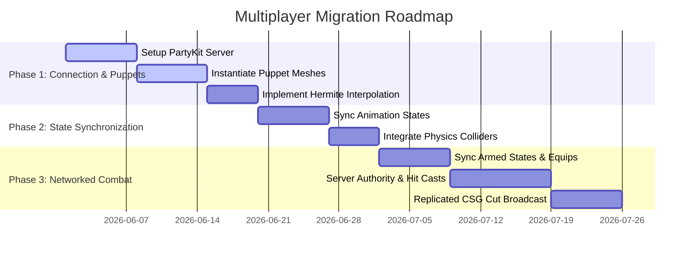

# Technical Analysis: Multiplayer Integration Pain Points & Determinism

This document analyzes the architectural shifts, features to drop, and components to make deterministic when migrating the local single-player codebase of `dreamfall` to a **4-player cooperative multiplayer** game powered by **PartyKit** on Cloudflare Workers/Durable Objects.

---

## 1. Multiplayer Architecture Overview

PartyKit runs on Cloudflare’s edge infrastructure using Durable Objects, which provide single-threaded, in-memory WebSockets with low latency. In a 4-player coop game, the PartyKit server acts as the room coordinator and state authority.

```mermaid
graph TD
    subgraph Client 1 (Player 1)
        C1_Input[Inputs] --> C1_Phys[Local Physics / Prediction]
        C1_Phys --> C1_Render[Three.js Render / Local CSG Cuts]
    end

    subgraph Client 2 (Player 2)
        C2_Input[Inputs] --> C2_Phys[Local Physics / Prediction]
        C2_Phys --> C2_Render[Three.js Render / Local CSG Cuts]
    end

    subgraph PartyKit Server (Cloudflare DO)
        Room[Room State Authority] --> Match[Combat & State Auth]
        Match --> Broadcast[State Broadcast System]
    end

    C1_Input -- WebSocket -- -> Room
    C2_Input -- WebSocket -- -> Room
    Broadcast -- WS State Update -- -> C1_Render
    Broadcast -- WS State Update -- -> C2_Render
```

---

## 2. What We Must Drop (Multiplayer Reductions)

To run a 4-player game at 60 FPS over WebSockets, we must drop direct synchronization of heavy visual and geometric operations. Instead, we partition them into **Server-Authoritative States** and **Client-Side Visual FX (VFX)**.

### A. Server-Side Mesh Cutting (CSG)
* **What it is**: The geometry clipping and face capping performed in [EnemyCutSystem.js](./src/game/systems/EnemyCutSystem.js).
* **Why drop it**: Cloudflare Workers have strict CPU runtime limits (typically 50ms) and lack WebGL/headless rendering capabilities. Running complex CSG bisection for multiple players and enemies on the server is impossible.
* **The Drop**: Do **not** run CSG on the server. The server only tracks the *state* of the enemy (e.g. "Enemy X is cut at Plane P"). The server broadcasts a lightweight JSON packet:
  ```json
  { "type": "enemy_cut", "enemyId": "soldier_4", "plane": { "normal": [0.707, 0, 0.707], "constant": -1.2 } }
  ```
  Each client receives this message and performs the actual geometric bisection and capping locally.

### B. Synced Ragdoll Bone Physics
* **What it is**: The physical simulation of 18–24 rigid bodies per cut shard mapping to bone transforms.
* **Why drop it**: Synchronizing the position and rotation of 24 bones per shard for multiple cut pieces over the network would overwhelm WebSocket bandwidth, causing severe lag and packet congestion.
* **The Drop**: Ragdolls must be treated as **purely visual client-side effects (VFX)**. 
  * The server only authorizes the death/cut event of the enemy.
  * When the client receives the event, it spawns the ragdoll shards locally in its own [PhysicsSystem.js](./src/game/systems/PhysicsSystem.js) world.
  * The pieces fall and collide locally on each player's screen. If a leg rolls slightly differently on Player 1's screen compared to Player 2's screen due to micro-variations, it does not impact gameplay.

### C. Continuous Joint-by-Joint Animation Syncing
* **What it is**: Sending every bone rotation in the character's skeletal hierarchy over the network.
* **Why drop it**: A standard character rig has 50–70 bones. Sending quaternions for all bones at 60Hz is too bandwidth-intensive.
* **The Drop**: Sync only locomotion parameters (e.g. position, velocity, heading, active animation state name, and normalized animation time). Let the client's local [AnimationStateSystem.js](./src/game/systems/AnimationStateSystem.js) blend and animate the remote player model.

---

## 3. What We Must Make Deterministic

For players to see the same gameplay state (e.g., enemies at the same positions, attacks hitting at the correct times), core systems must run deterministically or authoritatively.

### A. Physics Timestep stepping
* **The Pain Point**: If clients run at different frame rates (e.g., one at 30 FPS, another at 144 FPS), their physics simulations will drift rapidly if stepped using variable frame delta time.
* **The Solution**: The physics simulation in [PhysicsSystem.js](./src/game/systems/PhysicsSystem.js) must use a **Fixed Timestep** (e.g., exactly `1 / 60` seconds). During slow-motion V-press sequences, the timestep must be scaled identically across all clients:
  $$\Delta t_{\text{physics}} = \Delta t_{\text{fixed}} \times \text{timeScale}$$
  Both the server (if stepping coordinates) and clients must step their physics loops in sync using accumulated delta time.

### B. Combat Hit Registration
* **The Pain Point**: A client might register a sword slash hit locally in [CombatSystem.js](./src/game/systems/CombatSystem.js), but due to latency, the enemy was already somewhere else on the server.
* **The Solution**: 
  * Clients perform **Client-Side Prediction** for hits, showing instant visual/sound feedback (sparks, sword trails) to make attacks feel responsive.
  * However, damage and bisections must be **Server-Authoritative**. The client sends an "attack" intent to the server:
    ```json
    { "type": "attack_swing", "attackId": "swing_12", "timestamp": 1293848, "targetId": "enemy_3" }
    ```
  * The server verifies if the swing was valid at that timestamp (lag compensation/rollback) and resolves the hit, reducing enemy health and broadcasting the resulting cut plane.

### C. Enemy AI & Spawning
* **The Pain Point**: If enemies run AI logic locally on each client, they will chase different players on different screens, breaking the cooperative experience.
* **The Solution**: Enemy coordinates and behavior must be server-authoritative. 
  * The server runs a lightweight AI ticker (in the PartyKit Durable Object) that determines pathfinding targets and velocities.
  * The server broadcasts enemy positions and states (e.g., `idle`, `chasing`, `staggered`) to all clients.
  * Clients interpolate the enemy positions in [EnemySystem.js](./src/game/systems/EnemySystem.js) to keep their movement smooth.

---

## 4. PartyKit on Cloudflare: Implementation Blueprint

To bridge our local files with PartyKit, we structure the communication into a clean client-server contract:

### A. The PartyKit Server (`server.js`)
Runs on Cloudflare. Manages the connected players, validates rooms, coordinates ticks, and enforces authoritative state.

```javascript
// partykit/server.js
export default class GameRoom {
  constructor(room) {
    this.room = room;
    this.state = {
      players: new Map(), // id -> { position, velocity, state }
      enemies: new Map(), // id -> { position, health, state }
    };
  }

  onConnect(connection) {
    // Send initial room state to the newly connected player
    connection.send(JSON.stringify({
      type: "init",
      enemies: Array.from(this.state.enemies.entries())
    }));
  }

  onMessage(message, sender) {
    const data = JSON.parse(message);

    switch(data.type) {
      case "player_update":
        // Authorize and update player coordinates
        this.state.players.set(sender.id, data.payload);
        // Broadcast to other players in the room
        this.room.broadcast(JSON.stringify({
          type: "player_moved",
          id: sender.id,
          payload: data.payload
        }), [sender.id]);
        break;

      case "request_cut":
        // Server checks enemy health, applies damage, and authorizes the cut
        const enemy = this.state.enemies.get(data.enemyId);
        if (enemy && enemy.health > 0) {
          enemy.health = 0;
          this.room.broadcast(JSON.stringify({
            type: "enemy_cut",
            enemyId: data.enemyId,
            plane: data.plane
          }));
        }
        break;
    }
  }
}
```

### B. The Client-Side Sync Adapter (`MultiplayerSystem.js`)
An adapter added to [GameRuntime.js](./src/game/core/GameRuntime.js) that handles WebSocket events, translates remote player inputs to puppet meshes, and intercepts local cuts to request server authorization.

```javascript
// src/game/systems/MultiplayerSystem.js
import PartySocket from "partysocket";

export class MultiplayerSystem {
  constructor(runtime) {
    this.runtime = runtime;
    this.socket = null;
    this.remotePlayers = new Map(); // id -> THREE.Object3D (Puppet Mesh)
  }

  connect(roomId, playerId) {
    this.socket = new PartySocket({
      host: "localhost:1999", // PartyKit dev server
      room: roomId,
      id: playerId
    });

    this.socket.addEventListener("message", (event) => {
      const msg = JSON.parse(event.data);
      this.handleServerMessage(msg);
    });
  }

  // Sync local player update to server
  sendLocalUpdate(position, velocity, animState) {
    if (this.socket?.readyState === WebSocket.OPEN) {
      this.socket.send(JSON.stringify({
        type: "player_update",
        payload: { position, velocity, animState }
      }));
    }
  }

      case "enemy_cut":
        // Trigger the local geometric bisection on this client
        const enemy = this.runtime.enemySystem.getEnemyById(msg.enemyId);
        if (enemy) {
          this.runtime.enemyCutSystem.applyDirectCut({
            enemy,
            plane: msg.plane,
            physicsSystem: this.runtime.physicsSystem,
            enemySystem: this.runtime.enemySystem
          });
        }
        break;
    }
  }
}
```

---

## 5. Locomotion Synchronization: The Remote Puppet Model

To render other players in our 4-player cooperative match, we must not run their active input physics on all screens. Running full input and collision calculations for remote players would cause desynchronization and unnecessary CPU load. Instead, remote players are instantiated as "Puppets".

### A. Physics and Collider Representation
* Remote players are managed via [PhysicsSystem.js](./src/game/systems/PhysicsSystem.js).
* Instead of active kinematic/dynamic rigid bodies that respond to keyboard controls, remote players are given kinematic colliders or sensor colliders.
* These colliders do not execute gravity or step-climbing logic locally. Instead, they are moved directly (snapped) to the target position calculated from server updates. This ensures they still collide correctly with dynamic objects (like boxes or weapon sweeps) on the local client without drifting.

### B. State & Transform Interpolation
To solve network jitter and packet loss, we must use client-side interpolation rather than immediately snapping puppets to new coordinates:
* **Position & Velocity Buffer**: Maintain a short queue of past updates (e.g., 100ms lag buffer) containing `position`, `velocity`, `yaw`, and `timestamp`.
* **Interpolation Algorithm**: Every frame, the client interpolates the puppet's transform between the two updates surrounding the current target render time (which is `currentTime - interpolationDelay`).
* Use Hermite spline interpolation for position, using velocity to guide the tangents, ensuring fluid locomotion without linear hitching:
  $$\mathbf{p}(t) = (2t^3 - 3t^2 + 1)\mathbf{p}_0 + (t^3 - 2t^2 + t)\mathbf{v}_0 + (-2t^3 + 3t^2)\mathbf{p}_1 + (t^3 - t^2)\mathbf{v}_1$$
* Use spherical linear interpolation (Slerp) or linear interpolation (Lerp) for the player's horizontal heading (yaw).

### C. State Machine Replication
* The remote player’s character model runs an instance of [AnimationStateSystem.js](./src/game/systems/AnimationStateSystem.js).
* Rather than mapping to local inputs (`WASD`, `Space`, `Shift`), the puppet's state machine transitions directly to the requested state name (e.g., `Idle`, `Walk`, `Run`, `Brace`, `Jump`, `LedgeHang`) based on the packet update.
* Speed scales (such as `timeScale` on the mixer) are calculated directly from the replicated horizontal velocity vector.

---

## 6. Combat & Combat System Sync

With the implementation of the Great Sword combat system, synchronizing active slashes, combos, draw/sheathe transitions, and bisections is critical to preventing phantom hits and visual misalignment.

### A. Weapon Equipping and Armed Stance Sync
* **Equipped State**: Replicate the boolean `equipped` state. When a remote player draws or sheathes their sword, the local puppet model plays the equip/draw animation and handles weapon attachment logic dynamically.
* The sword mesh attaches to the appropriate character hand/sheathe bone (e.g., `mixamorigRightHand` or spine) on the remote puppet's rig.

### B. Hit Verification and Authority
In a high-intensity action game, client-side actions must feel instant. We use a **Client-Side Prediction with Server Verification** model:
1. **Local Action**: When Player 1 swings, their local [CombatSystem.js](./src/game/systems/CombatSystem.js) triggers the swing animation immediately.
2. **Local Sweep Casting**: The local client tracks the blade tip and base to detect intersections with enemies.
3. **Intent Packet**: On hit detection, the client sends a message to the server:
   ```json
   {
     "type": "combat_hit_intent",
     "enemyId": "soldier_3",
     "damage": 25,
     "attackName": "light_slash_2",
     "hitPoint": [10.5, 1.2, -4.5],
     "cutPlane": { "normal": [0, 1, 0], "constant": -1.2 },
     "timestamp": 1718903829000
   }
   ```
4. **Server Verification**: The PartyKit server verifies:
   * Is Player 1 actually in the attacking state?
   * Was the target enemy close enough to Player 1 at the client's timestamp? (The server stores a short history buffer of enemy positions to perform lag-compensated ray/capsule checks).
5. **Resolution**: If valid, the server reduces the enemy's health. If health reaches 0, the server broadcasts an authoritative `enemy_cut` event.

### C. Replicating the CSG Cut Event
Once the server authorizes a cut, it broadcasts the details to all connected clients.
* The message contains the exact target `enemyId` and the normalized mathematical plane ($N \cdot P + d = 0$).
* Every client receives the message, queries the enemy model in [EnemySystem.js](./src/game/systems/EnemySystem.js), bakes the skinned geometry at that exact moment, and passes it to [EnemyCutSystem.js](./src/game/systems/EnemyCutSystem.js).
* This ensures that while the physical shard drops are simulated locally (client VFX), the cut geometry is identical on all screens, maintaining visual consistency without saturating the network.

---

## 7. Collaborative Map Builder & Terrain Sync

The modular map builder in [MapBuilder.js](./src/map/MapBuilder.js) allows real-time manipulation of the chunked heightfield terrain. In multiplayer, if players are collaborating on a level, their edits must stay in sync.

### A. Sculpt Stroke Replication
Instead of sending the entire heightmap array (which is extremely large), clients sync the mathematical parameters of the brush strokes.
* When a player drag-sculpts on the terrain, the client sends the brush parameters over the WebSocket:
  ```json
  {
    "type": "sculpt_stroke",
    "chunkKey": "chunk_0_1",
    "mode": "raise",
    "center": [14.2, 8.5],
    "radius": 3.0,
    "strength": 0.5,
    "brushShape": "radial"
  }
  ```
* The PartyKit server validates the room's edit permissions and broadcasts the stroke parameters to all other clients.
* Each client applies the stroke locally, recalculating the terrain chunk heightfield, rebuilding the Three.js mesh vertex buffers, and updating the Rapier physics heightfield.

### B. Terrain Seam & Edge Coordination
* When a client resets the edges of a chunk using `Shift+R` (reset edges to procedural), the request is sent to the server.
* The server updates its canonical representation of that chunk's modified vertex list and tells other clients to reset the chunk edges locally.
* This prevents visual seams or physical gaps between adjacent chunks during collaborative building.

### C. Persistent Map Saving
* The server stores the authoritative map state in the Durable Object's persistent storage.
* When a new player joins a room in "Builder Mode", the server serializes the edited heightfields and transmits the `.json` state as an initialization bundle.

---

## 8. Bandwidth Optimization & Payload Serialization

Durable Objects are billed based on execution time and data transit. To minimize WebSocket message overhead, we must optimize the network protocol.

### A. Binary Serialization for Player Updates
Continuous updates (sent at ~20-30Hz) should avoid raw JSON string overhead. We pack player transforms into an ArrayBuffer:

```
Player Update Packet Format (34 Bytes):
+------+----------+------------------------+------------------------+------------+
| Type | PlayerID | Position (Float32 x 3) | Velocity (Float32 x 3) | Yaw (F32)  |
| 1 B  |   1 B    |         12 B           |         12 B           |    8 B     |
+------+----------+------------------------+------------------------+------------+
```

```javascript
// Binary packing implementation
function packPlayerUpdate(id, position, velocity, yaw) {
  const buffer = new ArrayBuffer(34);
  const view = new DataView(buffer);
  
  view.setUint8(0, 0x01); // Message Type: Player Transform Update
  view.setUint8(1, id);
  
  view.setFloat32(2, position.x);
  view.setFloat32(6, position.y);
  view.setFloat32(10, position.z);
  
  view.setFloat32(14, velocity.x);
  view.setFloat32(18, velocity.y);
  view.setFloat32(22, velocity.z);
  
  view.setFloat32(26, yaw);
  
  return buffer;
}
```

### B. Adaptive Tick Rate
* **High-frequency updates** (20-30Hz) are restricted to players who are close to each other.
* **Low-frequency updates** (5-10Hz) are used for players in distant terrain chunks.
* Unchanged objects (e.g., players standing still or idling) stop sending positional packets entirely, relying on a heartbeat check every 2 seconds to keep connections alive.

---

## 9. Conflict Resolution, Latency & Edge Cases

Cooperative multiplayer introduces network edge cases like packet loss and latency.

### A. Ledge-Hanging and Traversal Ownership Conflicts
If two players jump towards the exact same ledge slot simultaneously:
* Both clients predict the hang locally.
* They send a `{ type: "grab_ledge", ledgeId: "ledge_23_chunk_0" }` packet to the server.
* The server processes the messages sequentially. The first message received is granted ownership, and the server broadcasts `{ type: "ledge_owned", ledgeId: "ledge_23_chunk_0", ownerId: "player_1" }`.
* The client that lost the race (Player 2) receives the ownership update, cancels their ledge-hang state, and transitions back to a falling physics state (rollback).

### B. Slow-Motion (V-Press) Integration in Co-Op
In single-player, pressing the `V` key slows down time to draw a cut plane. In multiplayer, changing global timescales breaks simulation determinism for other players.
* **Decision**: Eliminate global slow-motion during multiplayer gameplay.
* **Replacement**: Pressing the aim/cut key triggers a local holographic aiming helper or localized visual slowdown (e.g., only slowing the target enemy's animation slightly on the active player's screen) while the actual physics simulation runs at normal speed.

---

## 10. Implementation Sequence & Testing Strategy



### Verification & Automated Testing
1. **Network Simulation Tests**: Use Chrome DevTools Network conditions (e.g., Fast 3G, 150ms latency, 2% packet loss) to verify that interpolation prevents puppet rubber-banding.
2. **Double-Cut Verification**: Write a Playwright smoke test where two clients connect to the same room, Client 1 triggers a sword cut on an enemy, and Client 2 verifies that the target enemy is cut into two distinct physical meshes locally.
3. **Durable Objects Load Testing**: Use Wrangler's testing environment to simulate 4 players sending updates at 30Hz, monitoring memory usage to guarantee CPU time per execution remains under the 50ms Cloudflare limit.
