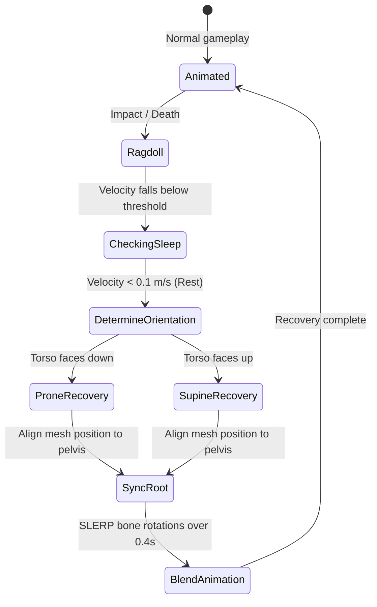

# Research: Humanoid Ragdoll, Sword-Cut Alignment, and Slow-Motion Systems in Three.js

This document provides a comprehensive technical overview of the mechanics, mathematics, and systems required for realistic humanoid ragdoll physics, dynamic sword-cut trajectory alignment, and cinematic slow-motion transitions inside a **Three.js** application.

---

## 1. Architecture: SkinnedMesh to Physics World

Implementing ragdoll physics requires mapping a visual **`THREE.SkinnedMesh`** (which uses a parent-child hierarchical bone structure) to a flat set of physical **Rigid Bodies** inside a 3D physics engine (like Rapier).

```mermaid
graph TD
    subgraph Three.js Render World
        Mesh[SkinnedMesh] --> Bones[Bone Hierarchy]
        Bones --> Bone1[Hips / Pelvis]
        Bones --> Bone2[Left Thigh]
        Bones --> Bone3[Left Calf]
    end

    subgraph Physics Simulation World
        World[Physics World] --> Bodies[Rigid Bodies & Colliders]
        Bodies --> Body1[Hips RigidBody]
        Bodies --> Body2[Left Thigh RigidBody]
        Bodies --> Body3[Left Calf RigidBody]
        
        Body1 -- SphericalJoint -- Body2
        Body2 -- RevoluteJoint -- Body3
    end

    Body1 -. Sync Position/Rotation .-> Bone1
    Body3 -. Sync Position/Rotation .-> Bone3
    Body2 -. Sync Position/Rotation .-> Bone2
```

### The Synchronization Loop
During ragdoll mode, character animations are disabled, and the physics simulation drives the bones:
1. **Bisection/Trigger**: Pause the keyframe animations (`THREE.AnimationMixer`).
2. **Step Physics**: Step the physics world to resolve gravity, impulses, and constraints.
3. **Map Transformations**: Read the world position and quaternion of each physical body and apply them back to the corresponding Three.js bone.

There are two primary mathematical techniques for mapping these transformations:

#### Technique A: Local Transformation Reconstruction (Hierarchical)
To keep Three.js's parent-child rendering tree intact, you must convert the world-space matrix of a physical body back into the local-space matrix of the corresponding bone:

$$M_{\text{local}} = (M_{\text{parent\_world}})^{-1} \times M_{\text{body\_world}}$$

Where:
* $M_{\text{body\_world}}$ is the transformation matrix generated from the physics body's world position and rotation.
* $M_{\text{parent\_world}}$ is the parent bone's final world matrix.
* $M_{\text{local}}$ is the new local matrix applied to the bone (`bone.position` and `bone.quaternion`).

#### Technique B: World-Space Override (Flat Update)
Set `bone.matrixAutoUpdate = false` for all bones in the ragdoll hierarchy, overwrite `bone.matrixWorld` directly using the world position and quaternion of its physical body, and call `bone.matrixWorldNeedsUpdate = true`.

> [!WARNING]
> While Technique B is simpler and slightly more performant, it breaks child objects (like weapons, armor, or particle attachment points) that rely on normal hierarchical matrix propagation, unless those attachments are also synced to the physics world.

---

## 2. Anatomical Joint Constraints & Limits

A natural-looking human ragdoll requires tight restrictions on how limbs can bend. Without limits, the character will look like an unnatural "bag of bones" (e.g., knees bending forward, neck rotating $360^\circ$).

| Joint / Bone Connection | Joint Type | Degrees of Freedom | Recommended Constraints & Angles |
| :--- | :--- | :--- | :--- |
| **Pelvis $\rightarrow$ Chest** | Spherical (Ball & Socket) | 3 | Highly restricted. Swing limits: $\pm 15^\circ$, Twist limits: $\pm 10^\circ$. |
| **Chest $\rightarrow$ Neck/Head** | Spherical | 3 | Moderate. Swing limits: $\pm 35^\circ$, Twist limits: $\pm 45^\circ$. |
| **Chest $\rightarrow$ Shoulder** | Spherical | 3 | Large range. Swing limits: $\pm 90^\circ$ (cone), Twist limits: $\pm 45^\circ$. |
| **Shoulder $\rightarrow$ Elbow** | Revolute (Hinge) | 1 | Single axis. Angle limits: $0^\circ$ (straight) to $145^\circ$ (fully bent). |
| **Pelvis $\rightarrow$ Hip/Thigh** | Spherical | 3 | Large range. Swing limits: $\pm 45^\circ$ (cone forward/sideways), Twist: $\pm 20^\circ$. |
| **Thigh $\rightarrow$ Knee** | Revolute (Hinge) | 1 | Single axis. Angle limits: $-140^\circ$ (fully bent backward) to $0^\circ$ (straight locked). |

---

## 3. Advanced Techniques for Natural Human Movement

### A. Active Ragdolls & Physical Animation
Active ragdolls combine animation targets with physical simulation so characters react naturally to impacts while retaining physical mass and self-preservation.

1. **PD (Proportional-Derivative) Controllers**:
   Instead of turning physics on/off like a switch, apply joint motor forces to drive the physical limbs toward the animated pose:
   $$\tau = K_p (\theta_{\text{target}} - \theta_{\text{current}}) - K_d (\omega_{\text{current}})$$
   Where $\tau$ is the joint motor torque, $K_p$ is stiffness, $K_d$ is damping, and $\theta_{\text{target}}$ is the joint angle from the keyframe animation.
2. **State Blending (Kinematic to Dynamic Transition)**:
   Slowly ramp a blend factor $\alpha$ between the animated pose and the simulated pose:
   $$\text{Pose}_{\text{final}} = \text{LERP}(\text{Pose}_{\text{animation}}, \text{Pose}_{\text{physics}}, \alpha)$$

### B. The Fall-and-Rise Sequence (Recovery)
Getting a ragdoll back up onto its feet requires a detailed alignment procedure:



#### Step 1: Detect Rest
Monitor the velocity of the root rigid body (Pelvis). Once the linear velocity drops below a threshold (e.g. $0.05 \text{ m/s}$), start the recovery sequence.

#### Step 2: Determine Orientation
Check if the character is lying face-up (supine) or face-down (prone) by finding the dot product between the chest's local forward vector and the global Up vector ($[0, 1, 0]$):

$$\text{dot} = \vec{v}_{\text{chest\_forward}} \cdot \vec{u}_{\text{world\_up}}$$

* If $\text{dot} > 0.7$, the character is **face-up (supine)**.
* If $\text{dot} < -0.7$, the character is **face-down (prone)**.

#### Step 3: Align Mesh Root
Before playing the "get up" animation, the main parent `THREE.Group` must be moved to the horizontal ground position directly below the pelvis body, and rotated around the Y-axis to match the pelvis's heading.
1. Capture the pelvis's world position $(x_p, y_p, z_p)$.
2. Project the pelvis forward vector onto the horizontal XZ plane to get the heading angle $\theta_y$.
3. Set the parent group's position to $(x_p, y_{\text{ground}}, z_p)$ and rotation to $(0, \theta_y, 0)$.
4. Reset the local offset of the root bone (Hips) so that it is positioned relative to the parent group instead of its old world coordinates.

#### Step 4: Blend Back to Keyframes
Trigger the appropriate "Get Up" animation clip. For the first few frames (e.g., $0.3 - 0.5$ seconds), interpolate the bones from their physical coordinates to their animated coordinates using Spherical Linear Interpolation (SLERP) to prevent visual popping.

---

## 4. Sword Cut Trajectory & Angle Alignment

To make physical geometry splits feel responsive, the bisection plane must align with the physical swing trajectory of the blade at the moment of impact.

### The Vertical Constraint Problem
Originally, the cut normal was calculated as:
$$\vec{n} = \vec{v}_{\text{swing}} \times \vec{u}_{\text{up}} = (z_s, 0, -x_s)$$
This forced the $y$-component of the normal to $0$, creating a vertical cutting plane regardless of the actual blade angle.

### The Swing Plane Solution
A flat plane in 3D space is defined by two vectors:
1. **The Blade Axis ($\vec{v}_a$)**: The longitudinal direction of the sword blade:
   $$\vec{v}_a = \vec{p}_{\text{tip}} - \vec{p}_{\text{base}}$$
2. **The Swing Velocity ($\vec{v}_s$)**: The motion direction vector of the blade:
   $$\vec{v}_s = \vec{p}_{\text{tip}} - \vec{p}_{\text{prevTip}}$$

The vector perpendicular to the plane of the swing is the cross product of these two vectors:

$$\vec{n} = \vec{v}_s \times \vec{v}_a$$

* **Overhead Chop**: Produces a sideways normal vector $(n_x, 0, 0)$, creating a vertical, front-to-back cut.
* **Horizontal Slash**: Produces a vertical normal vector $(0, n_y, 0)$, creating a flat, horizontal cut.
* **Diagonal Slash**: Yields a tilted normal vector with non-zero X, Y, and Z components, producing a diagonal cut matching the visual trajectory.

### Collinear Fallbacks (Stabbing)
If the player performs a thrust or stab, the swing velocity and blade axis vectors are collinear ($\vec{v}_s \parallel \vec{v}_a$), causing the cross product to collapse to $(0,0,0)$.
* *Fallback*: If the cross product is zero, fall back to crossing $\vec{v}_s$ with `UP` (which reverts to the vertical cut logic).

---

## 5. Slow-Motion Aiming & Separation (V-Press System)

To enhance visual clarity, the time-freeze behavior of the cut mode (triggered by pressing `V`) is replaced with a cinematic slow-motion sequence.

### Core Architecture
Instead of freezing the game runtime, the gameplay systems (locomotion, animations, combat, enemies) continue to run normally, but their updates are driven by a scaled delta time:

$$\Delta t_{\text{scaled}} = \Delta t \times \text{timeScale}$$

* **Aiming Phase**: When the user holds `V` to position the cut plane, `timeScale` is locked to `0.05` (5% speed). The environment crawls in slow-motion, allowing precise targeting.
* **Separation Phase**: When the cuts are committed, a `2.5`-second real-time timer is initialized.
* **Ramping Recovery**: The time scale is smoothly interpolated back to normal speed:
   $$t_{\text{normalized}} = \frac{\text{timer}}{2.5}$$
   $$\text{timeScale} = 0.05 + 0.95 \times (1 - t_{\text{normalized}})$$

### Dynamic Physics Timestep Integration
To prevent physics integration errors (such as pieces clipping or falling through the ground) during slow-motion, the physics engine's internal timestep is scaled dynamically:

$$\text{timestep}_{\text{world}} = 0.016 \times \text{timeScale}$$

This scales gravity and velocity resolution concurrently, allowing the severed halves to fall and collide with realistic weight and friction in slow motion.

### Input Partitioning
To prevent the player from running around normally while aiming cuts, inputs are separated:
* **Aiming Input**: The raw `input` is passed to the cut system so plane positioning and rotation function at responsive, unscaled speeds.
* **Gameplay Input**: Locomotion inputs are zeroed out, freezing the player character in their current animation pose (which ticks at 5% speed).
* **Camera Input**: Mouse inputs are zeroed out for the camera update, keeping the camera stationary relative to the player while aiming.

---

## 6. Physics Packages for Three.js

There is **no official out-of-the-box package** on NPM designed specifically as a "Three.js Human Ragdoll Generator". Developers must combine Three.js with a general 3D physics library. Below is a comparison of libraries suited for ragdoll simulations:

### A. Rapier.js (`@dimforge/rapier3d-compat`)
This is the **modern industry standard** for physics in Three.js and React Three Fiber (R3F), and is used natively in `dreamfall`.

* **Architecture**: Written in Rust, compiled to WebAssembly (Wasm).
* **Pros**:
  * High-performance WASM execution (multi-threaded, SIMD optimizations).
  * Extremely stable joints (Spherical, Revolute, Prismatic, Fixed) with built-in motors and limits.
  * Deterministic simulation.
  * Actively maintained.
* **Cons**: Requires loading a WebAssembly binary asynchronously at startup.

### B. Cannon-es (`cannon-es`)
A modern, community-maintained fork of the original `cannon.js` library written in pure JavaScript.

* **Architecture**: Pure JavaScript.
* **Pros**: Lightweight and simple to load (no WASM setup required).
* **Cons**: Lacks the stability required for complex joints; chaining multiple constraints together can cause ragdolls to jitter or explode.

### C. Ammo.js
A direct script-conversion of the C++ **Bullet Physics** engine via Emscripten.

* **Architecture**: Emscripten-compiled C++ assembly.
* **Pros**: Highly robust constraints and soft body physics.
* **Cons**: Complex, low-level, and unintuitive API; high memory footprint; prone to memory leaks if objects are not manually disposed.

---

## 7. Reference Boilerplates & Repositories

Because ragdoll mapping is complex, referencing existing boilerplate code is highly recommended:

1. **[mattvb91/rapierjs-ragdoll](https://github.com/mattvb91/rapierjs-ragdoll)**:
   * **Stack**: Vanilla JS / TypeScript + Three.js + Rapier.js.
   * **Value**: This is the best reference codebase. It includes a pre-rigged humanoid model, complete configuration files mapping bones to Rapier colliders, joint limit settings, and a fully functional update loop with debug visualizers.
2. **[jongomez/ragdoll.js](https://github.com/jongomez/ragdoll.js)**:
   * **Stack**: Babylon.js + Oimo.js/Ammo.js.
   * **Value**: Excellent reference for active ragdoll transitions and recovery math (prone vs. supine checks).
3. **[three.js / webgl_loader_mmd.html](https://github.com/mrdoob/three.js/blob/dev/examples/webgl_loader_mmd.html)**:
   * **Stack**: Three.js + Ammo.js.
   * **Value**: Shows how Three.js handles native MMD (MikuMikuDance) skeleton physics using its internal `MMDPhysics` solver.

---

## 8. Implementation Blueprint (Vanilla Three.js + Rapier.js)

Below is a conceptual class setup showing how to bridge Three.js bones with Rapier.js rigid bodies.

```typescript
import * as THREE from 'three';
import RAPIER from '@dimforge/rapier3d-compat';

interface RagdollBoneConfig {
  boneName: string;
  shape: 'capsule' | 'sphere' | 'box';
  size: number[]; // e.g. [radius, height] or [halfExtents]
  offset: THREE.Vector3; // Offset from bone joint to center of collider
  parentBoneName?: string;
  jointType?: 'spherical' | 'revolute';
  jointLimits?: number[];
}

export class RagdollManager {
  private character: THREE.Object3D;
  private skeleton: THREE.Skeleton;
  private world: RAPIER.World;
  private boneBodies: Map<string, RAPIER.RigidBody> = new Map();
  private boneConfigs: RagdollBoneConfig[];

  constructor(character: THREE.Object3D, skeleton: THREE.Skeleton, world: RAPIER.World, configs: RagdollBoneConfig[]) {
    this.character = character;
    this.skeleton = skeleton;
    this.world = world;
    this.boneConfigs = configs;
  }

  public initPhysics() {
    // 1. Create rigid bodies and colliders for each configured bone
    for (const config of this.boneConfigs) {
      const bone = this.skeleton.getBoneByName(config.boneName);
      if (!bone) continue;

      const worldPos = new THREE.Vector3();
      bone.getWorldPosition(worldPos);

      const worldQuat = new THREE.Quaternion();
      bone.getWorldQuaternion(worldQuat);

      // Create Rigid Body
      const rbDesc = RAPIER.RigidBodyDesc.dynamic()
        .setTranslation(worldPos.x, worldPos.y, worldPos.z)
        .setRotation({ x: worldQuat.x, y: worldQuat.y, z: worldQuat.z, w: worldQuat.w })
        .setLinearDamping(0.5)
        .setAngularDamping(0.5);
      
      const body = this.world.createRigidBody(rbDesc);

      // Create Collider Shape
      let colliderDesc: RAPIER.ColliderDesc;
      if (config.shape === 'capsule') {
        const [radius, halfHeight] = config.size;
        colliderDesc = RAPIER.ColliderDesc.capsule(halfHeight, radius);
      } else if (config.shape === 'sphere') {
        colliderDesc = RAPIER.ColliderDesc.ball(config.size[0]);
      } else {
        const [hx, hy, hz] = config.size;
        colliderDesc = RAPIER.ColliderDesc.cuboid(hx, hy, hz);
      }

      this.world.createCollider(colliderDesc, body);
      this.boneBodies.set(config.boneName, body);
    }

    // 2. Connect bodies using joint constraints
    for (const config of this.boneConfigs) {
      if (!config.parentBoneName || !config.jointType) continue;

      const body = this.boneBodies.get(config.boneName);
      const parentBody = this.boneBodies.get(config.parentBoneName);
      if (!body || !parentBody) continue;

      // Define local anchors relative to each body
      const anchor = { x: 0, y: 0, z: 0 }; 
      const parentAnchor = { x: 0, y: -0.2, z: 0 }; // Example offset

      let jointParams: RAPIER.JointData;
      if (config.jointType === 'spherical') {
        jointParams = RAPIER.JointData.spherical(anchor, parentAnchor);
      } else {
        jointParams = RAPIER.JointData.revolute(anchor, parentAnchor, { x: 1, y: 0, z: 0 }); // X-Axis Hinge
        if (config.jointLimits) {
          jointParams.limitsEnabled = true;
          jointParams.limitsMin = config.jointLimits[0];
          jointParams.limitsMax = config.jointLimits[1];
        }
      }

      this.world.createImpulseJoint(jointParams, parentBody, body, true);
    }
  }

  /**
   * Syncs the physical bodies back to the Three.js bones.
   * Call this inside requestAnimationFrame.
   */
  public update() {
    const parentInvMatrix = new THREE.Matrix4();
    const localMatrix = new THREE.Matrix4();
    const bodyMatrix = new THREE.Matrix4();

    for (const [boneName, body] of this.boneBodies.entries()) {
      const bone = this.skeleton.getBoneByName(boneName);
      if (!bone) continue;

      const translation = body.translation();
      const rotation = body.rotation();

      // Build World Matrix of the physical body
      bodyMatrix.compose(
        new THREE.Vector3(translation.x, translation.y, translation.z),
        new THREE.Quaternion(rotation.x, rotation.y, rotation.z, rotation.w),
        new THREE.Vector3(1, 1, 1)
      );

      // Compute local space transformation relative to the bone's parent
      if (bone.parent && bone.parent.isBone) {
        parentInvMatrix.copy(bone.parent.matrixWorld).invert();
        localMatrix.multiplyMatrices(parentInvMatrix, bodyMatrix);
      } else {
        localMatrix.copy(bodyMatrix);
      }

      // Decompose back to bone local position/quaternion
      localMatrix.decompose(bone.position, bone.quaternion, bone.scale);
    }
  }
}
```
